<div align="center">


<table>
  <tr>
    <td valign="top"></td>
    <td valign="top"></td>
  </tr>
</table>

# Roshan Ramani

Small, fast, shipped in public, with a changelog to prove it.

[](https://www.linkedin.com/in/roshan-ramani-0510102b2)

[](https://roshan-ramani.vercel.app/)
&nbsp;
[](https://www.linkedin.com/in/roshan-ramani-0510102b2)
&nbsp;
[](https://x.com/roshanramani007)
&nbsp;
[](https://n8n.io/creators/rawsun007/)

</div>


## `rawsun007@github ~ $ cat about.md`

- **Privacy-first web tools.** Everything runs in the browser. No upload, no server, no account.
- **macOS apps.** Swift, SwiftUI and AppKit, built for developers who live in the terminal.
- **AI and no-code automation.** 30+ published n8n templates with 32,000+ uses.

**Currently freelancing, and looking for an internship or an engineering role at a startup.**
I like small teams that ship fast and let one person own a thing end to end. The quickest way
to reach me is [X](https://x.com/roshanramani007) or
[LinkedIn](https://www.linkedin.com/in/roshan-ramani-0510102b2), and my work is at
[roshan-ramani.vercel.app](https://roshan-ramani.vercel.app/).


## `rawsun007@github ~ $ ls -l projects/`

### ClaudeNotch, approve Claude Code from your Mac's notch

[](https://github.com/rawsun007/claude-notch/stargazers)
[](https://github.com/rawsun007/claude-notch)
[](https://github.com/rawsun007/claude-notch)

A Dynamic-Island-style overlay that surfaces [Claude Code](https://claude.com/claude-code)
permission prompts, questions, cost and context usage in the MacBook notch. Read the diff,
approve or deny with one key, and never tab back to the terminal. Native menu-bar app in
Swift with SwiftUI and AppKit, works with VoiceOver, and runs entirely on your machine.

[Source on GitHub](https://github.com/rawsun007/claude-notch)
&nbsp;·&nbsp;
[ClaudeNotch website](https://rawsun007.github.io/claude-notch/)
&nbsp;·&nbsp;
[Download for macOS](https://github.com/rawsun007/claude-notch/releases/latest)

### MetaStrip, see and strip photo EXIF metadata in your browser

Shows exactly what a photo secretly carries, GPS location, device details and timestamps,
then strips it losslessly, byte by byte, entirely client side. No upload, no server, no
account. Selective field redaction, HEIC support, and an installable PWA with Android
share-target support. Built in vanilla JavaScript, one tested feature at a time.

[Open MetaStrip](https://metastrip.vercel.app/)
&nbsp;·&nbsp;
[MetaStrip changelog](https://metastrip.vercel.app/changelog.html)


## `rawsun007@github ~ $ n8n --stats`

30+ published templates with 32,000+ template uses across n8n and Needle. My survey report
generator, built with Jotform and Gemini, has passed 240+ views on its own. I work as an
[n8n creator](https://n8n.io/creators/rawsun007/) and a Needle content partner.


## `rawsun007@github ~ $ ls shipped/`

| Project | What it does | Live |
| --- | --- | --- |
| **GodPrompter** | Craft better AI prompts | [godprompter.com](https://godprompter.com/) |
| **GitHub Wrapped** | Your GitHub year, wrapped up | [GitHub Wrapped demo](https://github-wrapped-2026-steel.vercel.app/) |
| **PDF Toolbox** | Merge, split and convert PDFs in the browser | [PDF Toolbox demo](https://pdf-toolbox-eight-beryl.vercel.app/) |
| **iloveinvoice** | Create and download invoices | [iloveinvoice.live](http://iloveinvoice.live/) |
| **QR Code generator** | Generate custom QR codes | [qr-done](https://qr-done-five.vercel.app/) |


## `rawsun007@github ~ $ which swift python node`

The `whoami` card at the top lists all of it. The six I reach for most:


I use agents daily and treat their output as a draft, not a result. Vibe coding gets a
prototype standing in an afternoon. What ships gets read line by line, tested and reviewed.
ClaudeNotch exists for exactly that reason: it puts a human in the loop on every command an
agent wants to run.


## `rawsun007@github ~ $ make readme`

The heatmap, the portrait and the terminal card at the top are not hosted widgets.
They are SVGs generated in this repo, so nothing here can rate-limit or go down and
leave a broken image on my profile.

| Piece | Script | Refreshed |
| --- | --- | --- |
| `contrib-heatmap.svg` | `scripts/fetch_contributions.py` + `render_heatmap_svg.py` | Daily, by GitHub Actions |
| `ascii-portrait.svg` | `scripts/make_ascii_svg.py` | By hand, when the photo changes |
| `info-card.svg` | `scripts/make_info_card.py` | By hand, when the facts change |

GitHub strips `<script>` from a README but does render SVG through `` and does
run CSS keyframes and SMIL inside it, so all the animation lives in the files. The
contribution data is scraped from the public calendar page, no token needed, Python
stdlib only. Every animation plays once, freezes, and respects
`prefers-reduced-motion`.

```
python3 scripts/fetch_contributions.py   # writes data/contributions.json
python3 scripts/render_heatmap_svg.py    # writes contrib-heatmap.svg
STATIC=1 python3 scripts/make_info_card.py   # frozen frame for local preview
```

## `rawsun007@github ~ $ exit`

Building in public, one shipped feature at a time. Say hi on
[X](https://x.com/roshanramani007) or
[LinkedIn](https://www.linkedin.com/in/roshan-ramani-0510102b2).
